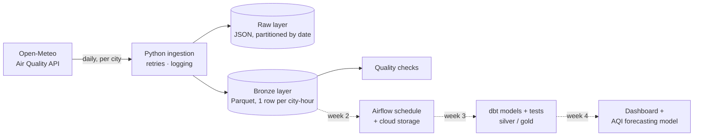

# India Air Quality Data Platform


An end-to-end **data engineering project** that collects hourly air-quality data for major Indian cities, stores it in a layered data lake, and (in upcoming weeks) orchestrates, models, tests and serves it for analytics and ML forecasting.

> **Status: Week 1 of 4 — ingestion layer complete.** Built in public; progress is logged below.

---

## Why this project

Air quality affects millions of people in Indian cities, and the data behind it arrives as messy, fast-changing API responses. This project shows how to turn that into **reliable, tested, analytics-ready data**, the same problems data engineers solve every day with business data.

## Architecture



Solid lines are built; dotted lines are on the roadmap.

## What's built (Week 1)

| Component | Details |
|---|---|
| **Config-driven sources** | Cities and pollutants live in [`config/cities.yaml`](config/cities.yaml) and are validated on load (coordinates, duplicates, empty lists) |
| **Resilient API client** | Retries on 429/5xx with exponential backoff, honours `Retry-After`, explicit timeouts |
| **Raw layer** | Untouched API responses saved as JSON: `data/raw/source=open_meteo/date=YYYY-MM-DD/<city>.json` |
| **Bronze layer** | Flattened Parquet, one row per city per hour: `data/bronze/air_quality_hourly/date=YYYY-MM-DD/` |
| **Idempotent writes** | Re-running a day overwrites its partition (atomic file swap), so retries and backfills never duplicate data |
| **Fault isolation** | One city's API failure is logged; other cities still load, and the run exits non-zero |
| **Data quality checks** | Duplicate keys, missing hours, negative pollutant values, excessive nulls; `--strict` blocks bad data |
| **Backfills** | `--start` / `--end` load any date range |
| **Tests + CI** | 13 pytest tests (no network needed) and Ruff linting on every push via GitHub Actions |
| **Daily live run** | A scheduled GitHub Actions workflow runs the pipeline against the live API every morning (07:00 IST), publishes a per-city summary and uploads the data as an artifact |

### Bronze schema

| Column | Type | Notes |
|---|---|---|
| `city`, `state` | string | From config |
| `latitude`, `longitude` | float | |
| `observed_at` | timestamp | Hourly, Asia/Kolkata |
| `pm10`, `pm2_5`, `co`, `no2`, `so2`, `o3` | float | μg/m³ |
| `us_aqi`, `european_aqi` | float | Index values |
| `source`, `ingested_at` | string, timestamp | Lineage |

## Quick start

```bash
git clone https://github.com/OmkarG-Star/india-air-quality-data-platform.git
cd india-air-quality-data-platform
python -m venv .venv && source .venv/bin/activate   # Windows: .venv\Scripts\activate
pip install -e ".[dev]"

python -m aqp.ingest                                  # yesterday, all cities
python -m aqp.ingest --date 2026-09-29                # one day
python -m aqp.ingest --start 2026-09-01 --end 2026-09-07   # backfill
python -m aqp.ingest --strict                         # fail on quality issues

pytest -q                                             # run tests
```

## Project structure

```
├── config/cities.yaml        # sources: cities + pollutants
├── src/aqp/
│   ├── config.py             # load + validate config
│   ├── client.py             # API client with retries
│   ├── transform.py          # raw -> bronze + quality checks
│   ├── storage.py            # partitioned, idempotent lake writes
│   └── ingest.py             # CLI / daily job
├── tests/                    # pytest suite with API fixtures
└── .github/workflows/ci.yml  # lint + test on every push
```

## Roadmap

- [x] **Week 1:** ingestion, raw + bronze layers, quality checks, tests, CI, daily scheduled run
- [ ] **Week 2:** Airflow DAG (Docker Compose), daily schedule, cloud object storage
- [ ] **Week 3:** dbt silver/gold models (daily city AQI, pollutant trends) with dbt tests, in a cloud warehouse
- [ ] **Week 4:** dashboard + next-day AQI forecasting model, final write-up

## Data source and attribution

Air-quality data comes from the [Open-Meteo Air Quality API](https://open-meteo.com/en/docs/air-quality-api), based on the **Copernicus Atmosphere Monitoring Service (CAMS)** ensemble. Values are modelled estimates, not official CPCB station readings. Used under Open-Meteo's free non-commercial terms. Test fixtures in `tests/fixtures/` are synthetic and only mimic the API's response shape.

## Author

**Omkar Gadhave** · Data Analyst → ML Engineer / Data Engineer · Pune, India
[LinkedIn](https://www.linkedin.com/in/omkar-gadhave-data/) · [GitHub](https://github.com/OmkarG-Star)
